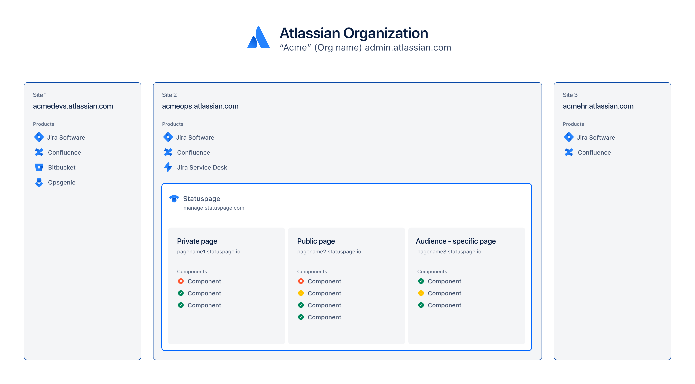
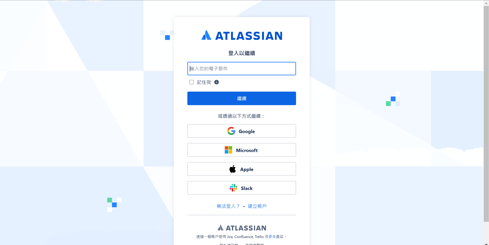
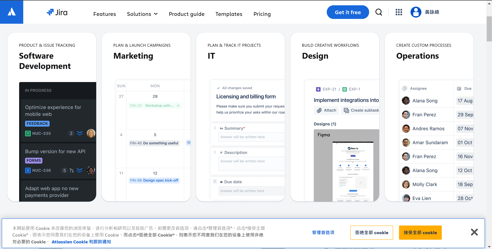
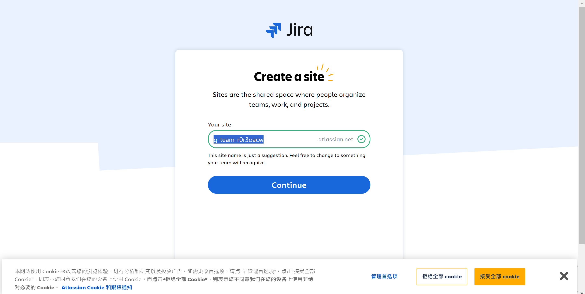
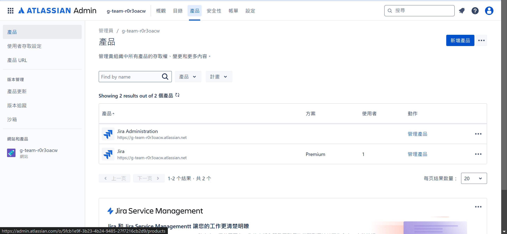
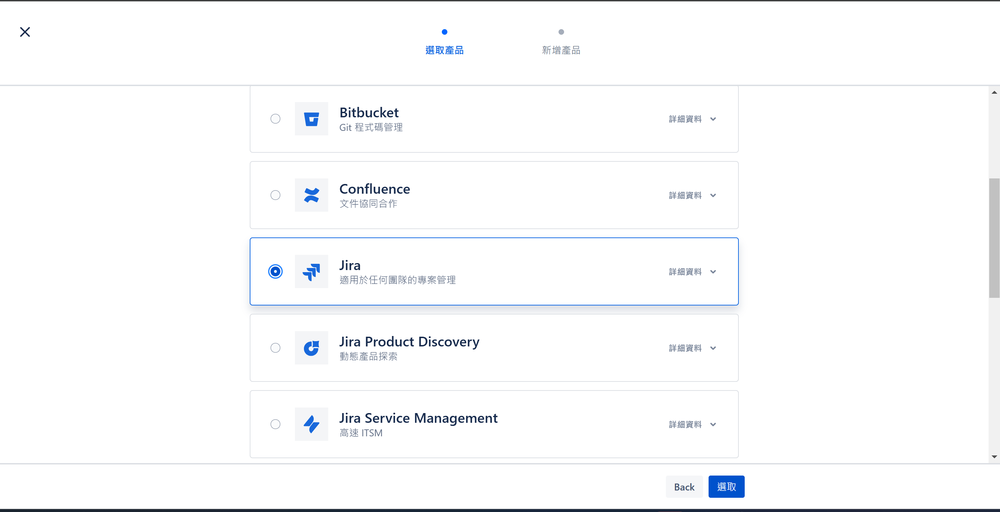
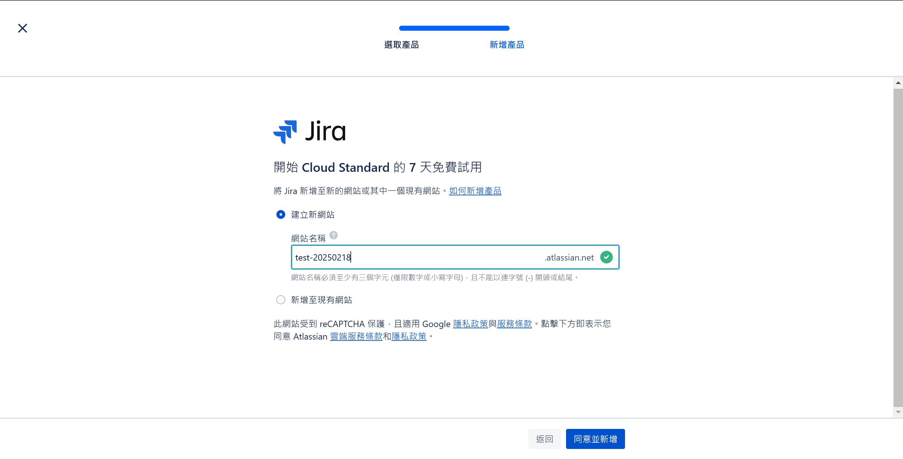
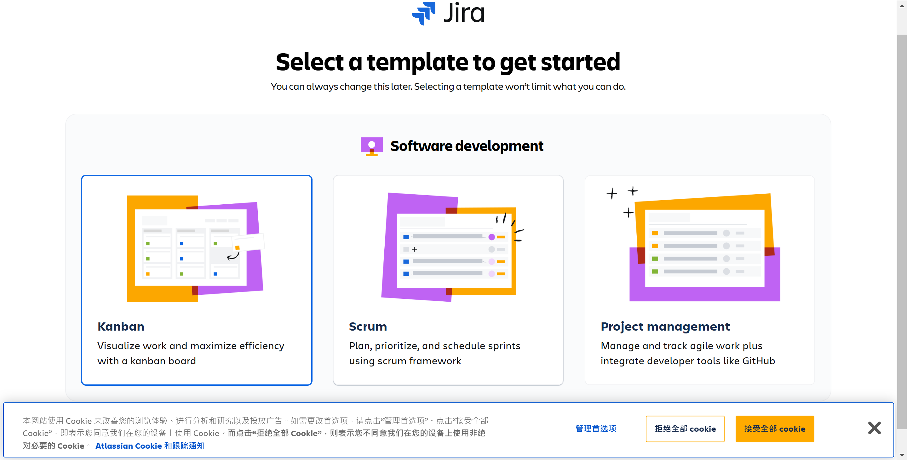

# 建立一個 Jira site

## Jira site 介紹
Jira Site 指的是 Jira 軟體的雲端環境，讓團隊可以在雲端上存取並管理專案。在一個組織內可以建立一個到多個專屬的 Jira Site (如下圖)，所有專案、看板、任務都會在這個 site 內運行。
> ps. 不過在同一個 site 內不能有兩個 Jira Cloud

## 建立步驟
### 如果你是第一次註冊 Jira
1. 創建帳號 
    - 它可能會讓你驗證帳號
2. 進入 Jira software 
3. 建立 site 
4. 完成，進入 module 3 吧

### 後續若要建立
1. 進入 [Administration - Atlassian](https://admin.atlassian.com/)
2. 點擊"產品" > "新增產品" 
3. 選擇 Jira 
4. 取一個名稱作為 site 
5. 之後就進入 module 3 啦 

## References
- https://support.atlassian.com/statuspage/docs/understand-atlassian-sites-and-organizations/