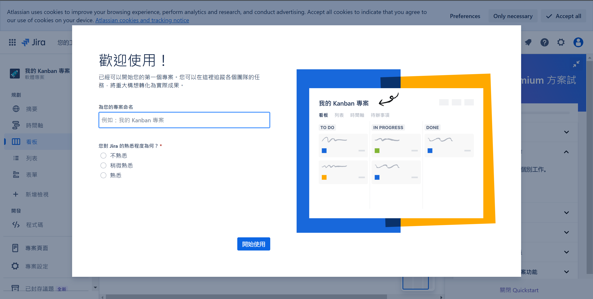
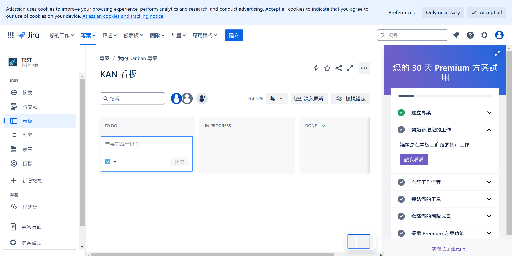
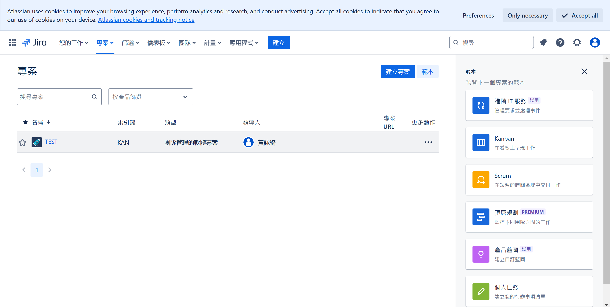
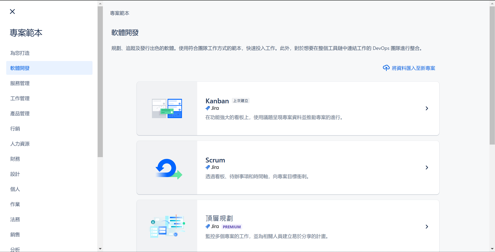
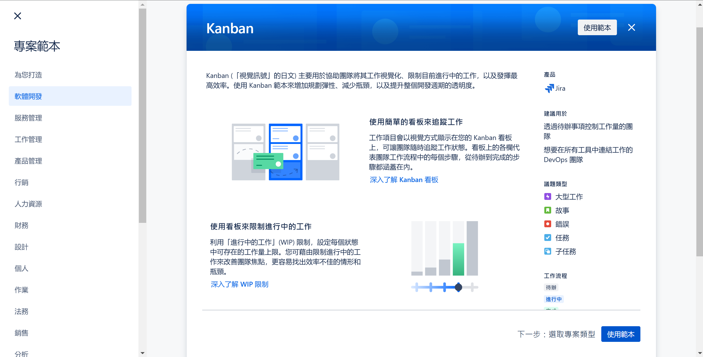
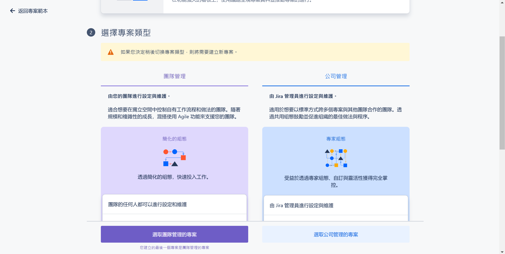

# 專案管理框架

在 **Jira** 裡有許多專案管理框架，其中在軟體開發中最常聽到的就是 **Kanban** 和 **Scrum** 都是 **敏捷專案管理（Agile Project Management）** 方法的一部分，主要用來**規劃、追蹤與管理專案**，並透過 **看板（Board）** 來視覺化工作流，但它們適用的場景和運作方式不同。在建立一個新專案的時候會看到以下畫面：

## **Kanban 在 Jira 中**
Kanban 一詞源於 Toyota 提出的精益生產模式 "かんばん"，意思是「視覺信號」、「卡片」，延伸也有布告板、揭示欄、廣告牌、招牌。Kanban 是一種視覺化工作管理方法，如今廣泛應用於軟體開發、專案管理與 IT 運維。它就是透過看板（Kanban Board，叫他看板就好，不要叫看板看板ww）來追蹤工作進度，確保團隊能高效協作與持續改進。

- **適用於持續交付（Continuous Delivery）**  
- **不受時間限制**，專案沒有固定的開發週期（Sprint）  
- 工作流通常包含 **To Do、In Progress、Done**  
- **Kanban Board**：顯示所有 Issue 的狀態  

來源：https://asana.com/zh-tw/resources/what-is-kanban

## **Scrum 在 Jira 中**
- **適用於短期衝刺開發（Sprint Development）**  
- **時間框架（Time-boxed）**：通常是 1～4 週的 Sprint  
- 透過 **Product Backlog → Sprint Backlog → 開發 → 測試 → 發布** 的方式工作  
- 適合 **新產品開發、敏捷開發團隊（Agile Team）**  
- **Scrum Board**：每個 Sprint 的任務清單  
- **Sprint 計劃**：每次 Sprint 開始前，團隊選擇要完成的工作  
- **Burn-down Chart**：追蹤 Sprint 進度  
- **可透過 Jira 的 Sprint 功能** 來管理週期性開發  

來源：https://www.workamajig.com/blog/scrum-methodology-guide/scrum-phases

## **📌 Kanban vs. Scrum 在 Jira 的主要差異**
|  **比較項目**  | **Kanban** | **Scrum** |
|----------------|-----------|-----------|
| **開發方式** | 連續開發（Continuous） | 迭代開發（Iterative, Sprint-based） |
| **時間限制** | 無固定週期 | Sprint（1～4 週） |
| **適用場景** | 需動態調整籌備的專案，或是業界中的　IT 運維、技術支援、持續開發 | 產品開發、敏捷軟體開發 |
| **工作管理方式** | 隨時開始新任務 | Sprint Backlog，固定時間內完成 |
| **Jira 工具** | Kanban Board | Scrum Board |
| **進度追蹤** | 看板流動狀態 | Burn-down Chart & Sprint 追蹤 |
| **變更應對** | 靈活應對變更 | Sprint 期間內避免變更 |

---

## 課程

在這堂課程裡，因為營隊籌備會需要比較大量的動態調整，所以我們會以 Kanban 當作本學期專案管理的框架！

## 建立步驟
### 第一次建立
1. 在第一次建立 site 後，系統就會讓你建立一個專案。這邊預設是 Kanban 
2. 完成 

### 後續若要建立
1. 進入 "專案"，點擊專案 
2. 選擇你要的團隊專案管理框架 
3. 使用範本 
4. 選擇專案類型 
    - 由於我們並非多階級劃分的團隊，而是團隊共同合作，不需要做權限劃分，所以這邊我們選團隊管理

## Reference
- https://asana.com/zh-tw/resources/what-is-kanban