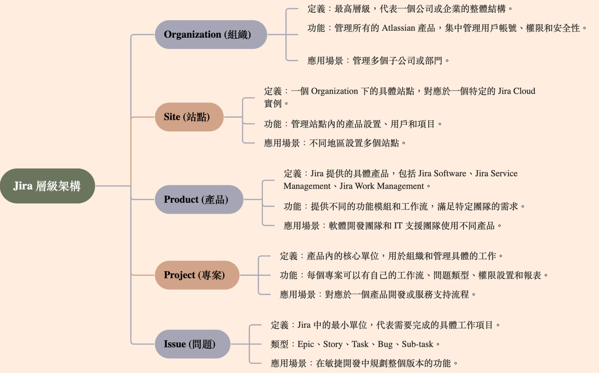
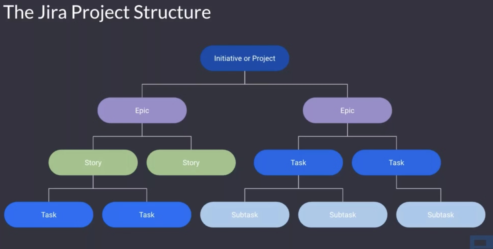
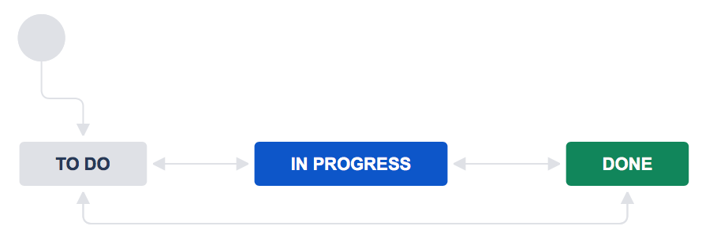
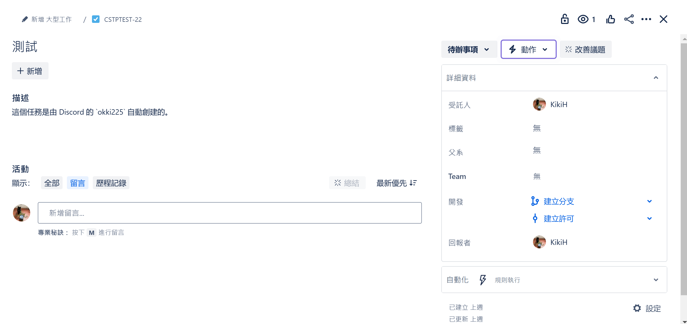
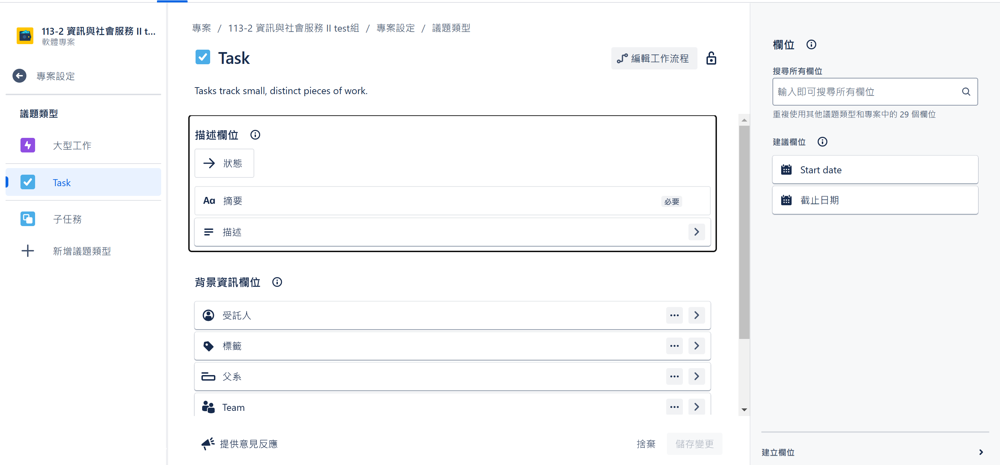

# 建立一個 issue

下圖是 Jira 這個團隊管理工具的層級架構，以我們服學課程為例子，最大的組織層級就是"服務學習團隊"，包含了老師、助教、學生等，再來就是 site，每一個小組都會管理一個 site，而每個 site 都可以管理許多專案，這邊我們的專案就是"辦營隊"或是"製作系上課程"等等。最後就是 issue。那什麼是 issue 呢?

## 什麼是 issue ?
- Issue 是 Jira 中最基礎的單元，也是成果交付的最小單位
- 包含關於該工作項目的詳細資料，如描述、負責人、狀態、優先級等

## issue 有哪些類型 ? 
**預設的 Issue 類型**

以下是每個 Jira 產品中預設的 Issue 類型列表：

### Jira 管理專案的 Issue 類型
Jira 的 issue 類型有許多，這裡介紹幾個:

- **Task（任務）** 
  - 任務代表需要完成的工作。
- **Subtask（子任務）** 
  - 子任務是完成一個任務所需進行的工作。
  - ps. 在這堂課裡，我們就不需特別劃分任務與子任務。
- **Epic（史詩）**  
  - epic 是需要被拆解的大型使用者故事。史詩將錯誤、故事和任務組合在一起，展示一個更大計劃的進度。
  - 在敏捷開發中，史詩通常代表一個重大的交付物，如軟體開發中新增的功能或體驗。
  - 是一種父級 Issue 類型

## issue 的狀態有哪些 ?
- **To Do**：尚未開始。
- **In Progress**：正在處理中。
- **Done**：完成的工作項目。

> [!Note] 
> 我們的任務就是把所有指派給我們的任務都變成 done

## issue 裡面有哪些資訊 ?
以下是 issue 的主要幾項資訊:

- 類型: task、epic 等等
- 狀態: to do、 in progress、done
- 優先級: 任務的緊急程度
- 描述: 關於這份 issue 的詳細說明，可以用來說明該工作項目的背景、需求、預期目標等。
- 受託人: 需要完成這個任務的人
- 回報者: 指派任務的人

## 建立 issue 時的 Tips
- 在敘述欄位定義 Definition of Done (DoD)
  - 避免"你的完成不是我的完成"
- 寫好 Due Date (截止日期)
- 適當分解任務，並指派 issue 給組員或自己
  - 範例: 假如有五個人要製作簡報，盡可能不要指派五個 "製作簡報" 的任務下去，而是要分好每個人具體製作簡報的範圍，像是製作第一天上午的簡報、製作遊戲環節的簡報...
  - 若想更好的使用 Jira，可以試著將其拆解成較小的子任務（Subtask）再指派

### 如果你的 issue 沒有 Due date 設置
1. 點進你的 issue 
2. 按下"設定"
3. 把截止日期的欄位加進去 

## References
- https://support.atlassian.com/jira-cloud-administration/docs/what-are-issue-types/